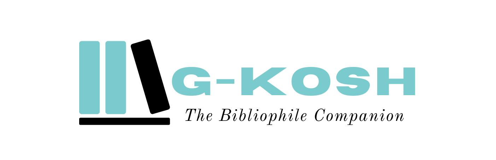

# GKOSH ( The Bibliophile Companion )

# Problem Statement :heavy_exclamation_mark:
DK182 - "Bibliophile Companion - A companion similar to an active agent, that helps the reader to organize and retrieve the highlighted text, bookmarked page and credentials of the content source in the cloud across heterogeneous platforms, gadgets and applications. "
- Ministry/ Organization Name:    Govt of Puducherry

# THE IDEA / SOLUTION :bulb:

### ANALYZING THE PROBLEM STATEMENT :thinking:
After analyzing the problem statement given by the Govt of Puducherry we understood that we have to keep a few key points in mind while providing the solution.
The current scenario requires the following things to deal with: 
- Information Storage
- Centralized System
- Different Sources of Information
- Cross Platforms
- Different extensions of data (eg. pdf, txt, doc, HTML, etc)

The whole idea is compiled into a Presentation that can be viewed here [Gkosh](https://www.canva.com/design/DADxetPkCCI/-u8tQ_zmklCJPtdQ8sQdmw/view?website#2:g-kosh-a-bibliophile-companion). This presentation contains all the basic ideas and the solution provided. 

# OVERVIEW OF THE SOLUTION :globe_with_meridians:
We are going to have three platforms for the frontend side which will be connected to a centralized backend server on the cloud. We will retrieve information/data through various sources and will store them on the centralized backend on the cloud so that we can fetch the same data on any platform whenever & wherever needed.

The platforms we will be providing are: 

1. BROWSER EXTENSIONS :computer:

A browser extension, also called a plug-in are a small set of software applications that adds capacity or functionality to a web browser.  They are used to add features and enhance the functionality of a website. For example: AdBlocker, HTTPS Everywhere, etc
 A user can collect data/information by SELECTING IT, SAVING THE PAGE or SAVING THE URL. We will have various right-click options and the extension will be connected to our backend server through our custom APIs. It will send and fetch the data directly from the user’s database. 
For the hackathon, we will be providing extensions for Google Chrome and Mozilla Firefox as these two are the widely used browsers. 

2. MOBILE APP :iphone:

The main attraction of our project is our fully-fledged mobile app from where a user will be able to manage all the exciting features we are providing.
According to a joint study by Associated Chambers of Commerce and Industry of India and PwC, The number of smartphone users in India is expected to rise by 84% to 859 million by 2022 from 468 million in 2017. This is the reason we are designing our app in a way that it will act as a personal assistant to the user.
The features of the mobile app will be as follows:
- FETCH FROM CLIPBOARD: Data or URL copied on the clipboard will be scraped by the application itself and will be saved onto the dashboard. Just copy the link to anything and the app will automatically detect the URL and will scrape and save it upon your request.  Scraping the data will help you to read the content from the app itself. It will save you from ads, broken links and offline access to the content. The app will also notify you if the data is changed from the original URL to keep you updated.
- SPEECH TO TEXT: You can record and save the Information through your voice. Just read out anything and the app will convert it to text and will save it for you. The classic example might be when you want to save some short notes, contact details, addresses, etc.
- LISTEN TO YOUR DOCS: You don’t need to just focus on your screen to read the document, you can listen to your docs while doing some other work. The classic scenario not limited but might be while traveling, cooking, or even while lying in bed. This feature is helpful for those who want to do multitasking and save their time.
- SAVE WHAT YOU SEE: Click a picture of anything from anywhere and the app will save the information by processing it accordingly. It depends upon the type of document which can range from text, picture or video. The app will detect it accordingly and save it for you. 
- MANUAL MODE: save any file/document/ information you want and organize it as per your need. You will be able to save any piece of information from your device by selecting and uploading it. You can also differentiate and group the document as per your needs.

3. WEB APPLICATION :earth_asia:

The web application hosted on a domain is the platform you can access from your computer/laptop or on any device having a web browser. You can sign in to get access to your database.  This is the benefit of using a centralized cloud database and providing features through APIs, You only need to create a single backend service for all of your platforms. 
Although all the basic functionality that is on the mobile app will be available on the web application too but apart from that the few features might be:
- DASHBOARD: It will provide an interface to all your saved data over the cloud. You will be able to read and edit using the interface itself.
- CUSTOMIZATION: You can customize and organize all your information/data as per your need.
- LIBRARY: Search from your existing library or save the new data manually.

# THE REAL SOLUTION TO THE REAL PROBLEM :bar_chart:

We as a team believe that each and aspect of the problem should be discussed thoroughly so that we can make the solution future-proof. 
After a few brainstorming sessions, we came to the conclusion that providing an efficient, scalable, cross-platform solution is not sufficient. 
So What’s the Real Problem?
Remember a time when you bookmarked a really interesting article for the future. Did you ever use it? Just go through your bookmarks and see how many interesting things you have saved and literally forgot each one of them.
 
THE REAL PROBLEM IS NOT HOW, WHERE AND WHAT YOU SAVE. 
THE REAL PROBLEM IS TO RECALL IT WHENEVER NEEDED.

We take this problem very seriously and worked very hard to design the best possible solution. 
1. AUTOMATED CLASSIFICATION OF DATA
The custom Machine learning model we develop will automatically classify our data and save them accordingly. Each and everything you save will be automatically classified into different classes according to their semantics. The ML algorithms we are planning to implement for this are BoW(Bag of Words), Word2Vec(Word to vectors), TF-IDF or GloVe.
2. CLASSES WE PROPOSE
The labels we provide will group different data/Information(not limited) to Education, food, living, Shopping, places, etc. We are also planning to differentiate text, pics, and videos.
3. CHAIN OF INFORMATION
There is one exciting feature we are planning to implement which will make the project even more useful than ever.
Suppose you are working on a project. You need article A to start your project, then Article B, then C and so on. This is the order of articles you need to read to complete your project. Now you want to save the data in that order only so that you can fetch it one after another. 
This is just a single example and the real scenario can be more complex.
So we are planning to develop a system where user will be able to save a continuous chain of data so that he/she may fetch them in that order whenever needed.

# Design :computer:

# REVENUE GENERATION :moneybag:

We as a team have already worked on several projects and have a history of doing exceptionally well in 10+ hackathons across the country till date.  
The major reason is that we work on the all-round development of the project to make it market-ready.
The one motto we always keep in mind is that It is not possible for a project to be sustainable if it’s not generating income. And don’t forget about app development expenses, you have to return those investments, right?  
We want our project to be fully functional in real-world scenarios and being maintained over time. 
Our app monetization model has the solution on how our project can earn revenue, generate profits higher than the average return on investment (ROI).
- We have no Ads rule. Although in-app ADVERTISING can be a great way of generating revenue we want to provide a seamless experience to our users. We don’t want to keep our User Experience on stake just for the sake of monetization.
- Many users respond with dissatisfaction or even anger when they come across in-app ads. So we will have 0 ads in any of our cross-platform applications.
LEAD GENERATION AND AFFILIATE MARKETING: Affiliate marketing is a means of promoting other people’s (or business) products and earning a commission in return. We can show different related articles from various other sources and generate revenue from that. The promotional product can range from various related Articles, Books or any physical or software product related to your saved data/information.
The company will be delighted that they have a new sale from a client that they didn’t expect. Also, the client will be happy that they learned about a product directly from you that will meet their needs or desire.
FREEMIUM: All we will do is to offer users with a functional, basic and full free version of our project. After some time, this will persuade the potential users to become regular clients by providing them a premium, advanced, feature-rich version for a price. 
The freemium features are not decided yet and it will be fixed upon the agreement of features from the Govt of Pudducherry.
IN-APP BROWSING: We can secure a partnership with browsers like Chrome, Firefox or Opera to provide in-app browsing. This will significantly step up our monetization game but will also provide more power to the user. 

# TECHNOLOGY 🔧

1. WEB EXTENSION
The Extension components will be created with web development technologies: HTML, CSS, and JavaScript. 
The User Interface will have the option to save the selected text, whole page or the URL. Right-click on the page will enable the options for you. 
Your data will be directly saved to your profile’s database on the cloud.
The extension will be connected to the back-end through the APIs created by us and will directly interact with the database through requests.

2. MOBILE APPLICATION
The front-end of the mobile application will be created using React Native and Redux (for state management). React native will allow us to create a cross-platform app for Android as well as for iOS. 
For backend, we are going to use Node.js to connect the app to the server and handle the requests.  Node.js runs single-threaded, non-blocking, asynchronous programming, which is very memory efficient.

3. DATABASE
For creating the user’s database we are using MongoDB Atlas. It is a database as a service platform(DBaaS) by MongoDB. It provides an easy way to host and manage the data in the cloud. We don’t need to worry about finding a new product as we scale. MongoDB Atlas will keep an eye on production and security for us and has insanely high throughput and low latency, even at a high scale.

4. APIs
We need to handle data consumption requests and data manipulation requests from clients using HTTP. It is the norm to pass JSON data between these requests so it makes sense to use a NoSQL document database because JSON and similar is the common storage format, eliminating the need to marshal data to new formats in every request.
We’re going to create RESTful APIs using Node.js and Express Framework that will communicate to the cloud instance of MongoDB called Atlas.

5. Machine Learning Models
For the classification of saved information into various classes, we are going to train our own custom model. The data/information will be passed through the model using API and the Model will label the document according to the prediction score. The labeled document will then be stored in its respective category. 
The model will be implemented using information retrieval and text similarity algorithms like word2vec or BoW.

6. MISCELLANEOUS STACKS
For user authentication, we are using Firebase auth. Firebase Authentication is necessary to grant read/write privileges to your users via security rules. 
For web scraping, we are using Cheerio. It is a fast, flexible, and lean implementation of core jQuery designed specifically for the server.
For listening to the requested document we are using the Text-to-speech engine(TTS). Google Cloud Text-to-Speech converts text into human-like speech in more than 180 voices across 30+ languages and variants.

# USE CASE 👨‍💻
There can be many different use cases of GKosh and it totally depends upon the user.  
But the common use case might be this:
Suppose you are surfing the internet and found one article about the top 10 travel destinations in India. You want to travel to someplace this holiday with the minimum budget but you are unaware of the locations and its travel expenses. You are in a hurry and you don’t have the time to read the whole article so you save it for later. You choose GKosh web extension because you are on a laptop. The GKosh web API will send the document to the cloud database after differentiating it into “Travel Class” by our custom Machine Learning model. Now you can access the documents from your mobile phone or web or any device platform we provide. You don’t need to remember what you saved, whenever you will open your dashboard it will give you the classified menus and from there you can go to your Travel class and there you will find all the related documents linking to travel that you saved earlier. The chain of information feature will give you access to link the documents in order so that you can fetch them one after one serially.

# 📜 License
This Project is licensed under the [Apache-2.0](/LICENSE) © [HypnOS](https://github.com/Hypn-OS).
